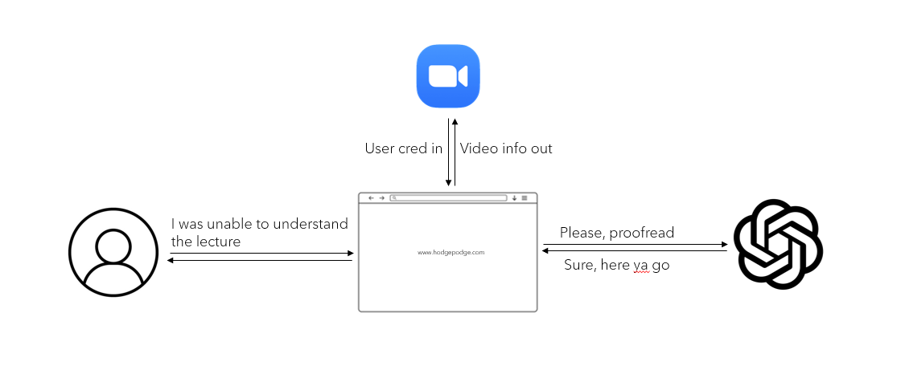
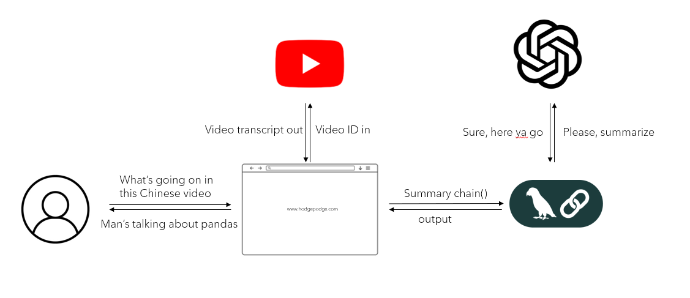

# HodgePodge

This repository contains two Python modules: `ZoomTranscript Analyzer` and `YouTube Video Summarizer`. These modules leverage the power of OpenAI's GPT models and various utilities from the LangChain community to analyze and summarize transcripts.

## ZoomTranscript Analyzer



### YouTube Summarizer



### Features

- Proofread and correct Zoom transcripts.
- Generate inline diff for original and proofread transcripts.
- Fetch and summarize YouTube video transcripts.

### Installation

1. Clone this repository:
    ```bash
    git clone https://git.txstate.edu/ane80/HodgePodge.git
    cd your_repository
    ```

2. Install the required dependencies:
    ```bash
    pip install -r requirements.txt
    ```

3. Create a `.env` file and set your environment variables:
    ```env
    OPENAI_API_KEY=your_openai_api_key
    ```

### Usage

1. Run the Flask application:
    ```bash
    python app.py
    ```

2. Open your web browser and go to `http://localhost:5000` to access the web interface.

### Endpoints

- `/`: Home page and transcript uploading
- `/youtube`: Fetch and summarize YouTube video transcript


### Code Overview

#### Main Functions

- `proofread_transcript(transcript)`: Uses OpenAI's GPT model to proofread and correct the transcript.
- `generate_inline_diff(original, proofread)`: Generates inline differences between the original and proofread transcripts.
- `get_transcript_and_summary(video_id, language="en", translation="en")`: Fetches and summarizes the YouTube video transcript.